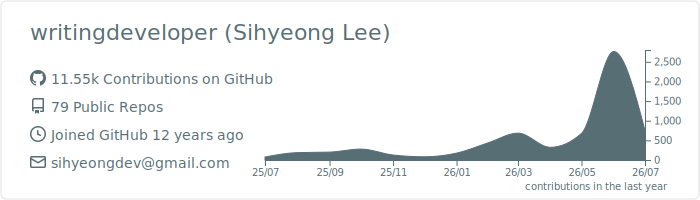
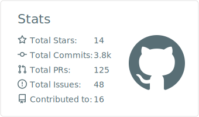
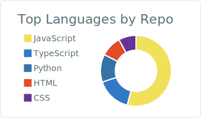

# Sihyeong Lee — `writingdeveloper`

**Solo developer in Los Angeles.** I ship small, useful web & desktop tools — and I like owning the whole stack, from the first idea to the box it runs on.

Most of what I build scratches a real itch: a tenant checking their rights, a habit I wanted to break, a dashboard I wished existed. I keep scope honest, ship fast, and reach for my own tooling before renting someone else's SaaS.

Los Angeles · [writingdeveloper.blog](https://writingdeveloper.blog)

## Featured

| Project | What it is |
|---|---|
| **[rentrights](https://github.com/writingdeveloper/rentrights)** · [live ↗](https://rentrights.writingdeveloper.blog) | Estimates an LA renter's rent-law protections from just their address — open civic-tech on PostGIS + Census data. |
| **[devdeck](https://github.com/writingdeveloper/devdeck)** | Command deck for Claude Code: git state, staleness, and one-click resume across every project. |
| **[dont-touch-electron](https://github.com/writingdeveloper/dont-touch-electron)** | Detects face-touching to help break habits like trichotillomania. Electron + MediaPipe. |
| **[voice-studio](https://github.com/writingdeveloper/voice-studio)** | Clones a character's voice from video and fine-tunes a GPT-SoVITS v4 model. Python + local GPU. |

## The `-deck` suite — a cockpit I own

Local-first dashboards I built to run my own operation instead of renting a wall of SaaS tabs — **devdeck** (Claude Code projects) · **[SiteDeck](https://github.com/writingdeveloper/SiteDeck)** (GA4 · PageSpeed · Search Console) · **opsdeck** (self-hosted status board) · **MarketDeck** (marketing readiness — *in progress*).

## Also shipping

**[shipwright](https://github.com/writingdeveloper/shipwright)** (Next.js + Turborepo MVP starter) · **[zodiacly ↗](https://zodiacly.vercel.app)** (AI daily-horoscope platform, US + LatAm) · **[Mini-Games ↗](https://games.writingdeveloper.blog)** (four render engines + multiplayer) · **[ClipShrink](https://github.com/writingdeveloper/ClipShrink)** (Discord companion for free users: image auto-compression + a Nitro-free emoji/sticker/GIF picker — no client mods)

→ Full catalog and write-ups at **[writingdeveloper.blog](https://writingdeveloper.blog)**

## Reach me

[Blog](https://writingdeveloper.blog) · sihyeongdev@gmail.com  
Open to select freelance and genuinely interesting problems.

---

## GitHub stats

<!-- Cards are static SVGs generated by a GitHub Action (github-profile-summary-cards) — no external runtime dependency. -->

<picture>
  <source media="(prefers-color-scheme: dark)" srcset="./profile-summary-card-output/github_dark/0-profile-details.svg" />
  
</picture>

<picture>
  <source media="(prefers-color-scheme: dark)" srcset="./profile-summary-card-output/github_dark/3-stats.svg" />
  
</picture>

<picture>
  <source media="(prefers-color-scheme: dark)" srcset="./profile-summary-card-output/github_dark/1-repos-per-language.svg" />
  
</picture>
