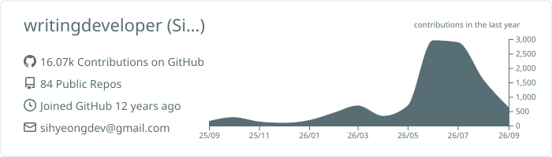
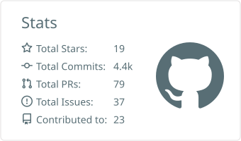
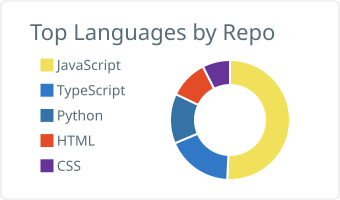

# Sihyeong Lee — `writingdeveloper`

**AI-native product engineer in Los Angeles.** I build and operate developer tools, applied-AI systems, production full-stack products, and the infrastructure behind them.

I use coding agents heavily, but I keep the engineering decisions explicit: architecture, constraints, acceptance criteria, failure analysis, testing, deployment, and what actually ships. Before the current agentic workflow, I spent years building the same stack directly; today I use that background to make the agents faster without outsourcing ownership.

Los Angeles · remote-first · US · [writingdeveloper.blog](https://writingdeveloper.blog) · **[Work with me ↗](https://writingdeveloper.blog/en/hire)**

## Selected engineering work

| Project | What it proves |
|---|---|
| **[DevDeck](https://github.com/writingdeveloper/devdeck)** | Developer tooling for Claude Code, Codex and Antigravity: Git/session state, embedded terminals, resumability, Electron security, CI and desktop releases. |
| **[RentRights](https://github.com/writingdeveloper/rentrights)** · [live ↗](https://rentrights.writingdeveloper.blog) | Production full-stack/data engineering over LA County + Census data; an indexed lookup path cut a 13–55s scan to about a second, with live scheduled E2E checks. |
| **[citefirst](https://github.com/writingdeveloper/citefirst)** | Measured RAG over the PostgreSQL manual: hybrid retrieval, local reranking, citation validation, explicit failure analysis, and repeatable evaluation instead of qualitative claims. |
| **[studios](https://writingdeveloper.blog/en/studio)** | Private MCP/GPU generation platform for image, video, 3D, voice and music: shared GPU arbitration, asset lineage, machine gates, review loops, FastAPI/React gallery and hundreds of tests. |
| **[Toolsmith](https://github.com/writingdeveloper/toolsmith)** · [live ↗](https://toolsmith.writingdeveloper.blog) | Browser-only file tooling across Web Workers/WASM/WebCodecs-style pipelines, keeping user files off a backend. |
| **[JuiceBar](https://github.com/writingdeveloper/JuiceBar)** | Windows systems/desktop engineering: CPU/GPU/battery sensing, calibrated power estimation, tariff validation, local history, packaged releases. |

## How I work

I tend to own the whole path: problem framing → architecture → implementation → tests and QA → deployment → production operations. Recent systems also include local/remote GPU orchestration, MCP servers, RAG evaluation, CI/release gates, and self-hosted infrastructure over Tailscale.

The through-line is not “AI wrote the code.” It is **using AI implementation agents while keeping system ownership and verification human-readable and testable**.

→ Full project ledger and build notes: **[writingdeveloper.blog](https://writingdeveloper.blog)**

## Work with me

Open to remote **Senior Product Engineer**, **Applied AI / AI Platform Engineer**, and **Senior Full-Stack Engineer** roles in the US, plus focused project work around agent workflows, custom MCP servers, RAG systems, and Next.js / NestJS / Python products.

Previously I owned engineering for 5+ years as a CTO; more recently I have been hands-on across the systems above from architecture through production operations.

**→ [Portfolio / availability](https://writingdeveloper.blog/en/hire)** · sihyeongdev@gmail.com

---

## GitHub stats

<!-- Cards are static SVGs generated by a GitHub Action (github-profile-summary-cards) — no external runtime dependency. -->

<picture>
  <source media="(prefers-color-scheme: dark)" srcset="./profile-summary-card-output/github_dark/0-profile-details.svg" />
  
</picture>

<picture>
  <source media="(prefers-color-scheme: dark)" srcset="./profile-summary-card-output/github_dark/3-stats.svg" />
  
</picture>

<picture>
  <source media="(prefers-color-scheme: dark)" srcset="./profile-summary-card-output/github_dark/1-repos-per-language.svg" />
  
</picture>
